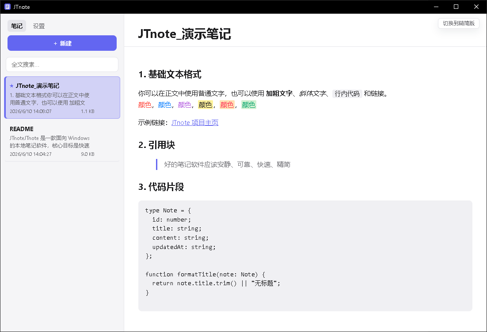
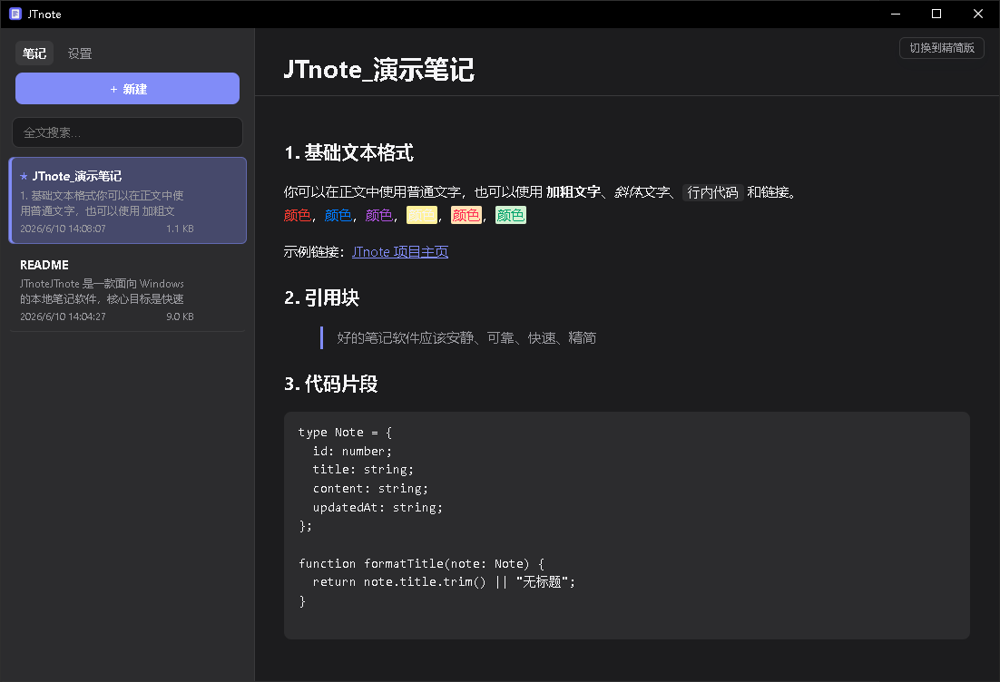
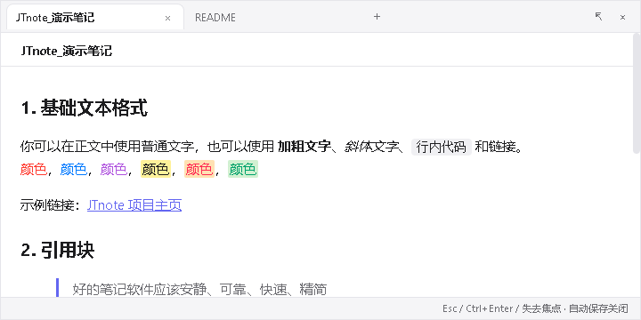
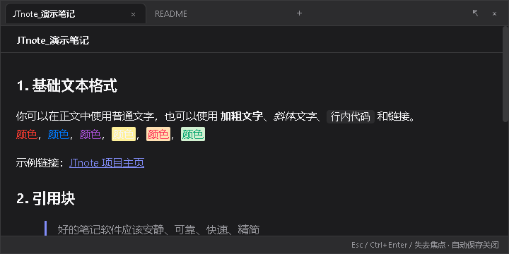

# JTnote

JTnote 是一款面向 Windows 的本地快速笔记工具。它专注于“随手记录”：通过鼠标中键或全局快捷键呼出小窗，输入后自动保存，失去焦点后自动关闭。

所有笔记、设置、图片和备份都保存在本机。JTnote 不需要账号，不上传笔记，不内置云同步，也不包含统计上报。

> 一个本地优先、随时呼出、低打扰的 Windows 快速笔记工具。

## 为什么做 JTnote

很多笔记软件很强，但也很重。临时记录一个想法、会议里的几句话、代码片段、图片备注时，打开完整知识库或云笔记经常会打断思路。

JTnote 的目标是：

- 比记事本更可靠
- 比大型笔记软件更轻
- 比云笔记更私密
- 比普通便签更适合快速捕捉
- 让笔记、图片和备份都留在本机

适合用来记录：

- 临时想法
- 会议纪要
- 待办事项
- 代码片段
- 图片备注
- 本地资料整理
- 快速草稿

## 下载

请从 GitHub Releases 下载最新版本：

https://github.com/Daniel-Wu-1/JTnote/releases

推荐大多数用户下载：

- `JTnote_0.1.0_x64-setup.exe`  
  标准安装包，适合日常使用。

也可以选择：

- `JTnote.exe`  
  免安装版本，下载后可直接运行。

- `JTnote_0.1.0_x64_en-US.msi`  
  MSI 安装包，适合 Windows Installer、企业部署或批量安装场景。

## 截图









## 主要功能

- 本地笔记保存
- 鼠标中键或快捷键呼出快速记录窗口
- 精简小窗与完整主界面共用同一套笔记数据
- 自动保存
- 小窗失焦后自动保存并关闭
- 富文本编辑
- 标题、字号、颜色、高亮、对齐、列表、引用、代码块等格式
- 自定义颜色选择
- 粘贴或插入图片
- 图片本地保存，并按笔记分类管理
- 删除正文图片后自动清理不再引用的本地图片文件
- 删除笔记时同步清理对应图片目录
- 笔记置顶
- 笔记拖拽排序
- 搜索笔记
- 单条笔记导出
- 全量 JSON 备份导出
- JSON 备份导入并恢复图片
- 自动备份
- 深色 / 浅色主题
- 多语言界面
- 系统托盘常驻
- 开机自启选项

## 本地优先与隐私

JTnote 默认不需要账号，也不会把笔记上传到任何服务器。

设计原则：

- 不需要登录
- 不上传笔记
- 不内置云同步
- 不内置统计上报
- 笔记保存在本机 SQLite 数据库
- 图片保存在本机文件夹
- 设置保存在本机 JSON 文件
- 自动备份保存在本机

默认数据目录：

```text
%APPDATA%\com.jtnote.app\
```

常见文件和目录：

```text
%APPDATA%\com.jtnote.app\notes.db
%APPDATA%\com.jtnote.app\settings.json
%APPDATA%\com.jtnote.app\images\
%APPDATA%\com.jtnote.app\backups\
```

SQLite 运行时可能还会生成：

```text
notes.db-wal
notes.db-shm
```

## 图片管理

粘贴或插入到笔记中的图片会被复制到本地图片目录。

每条已保存笔记都有独立图片文件夹。文件夹名称包含笔记 ID 和笔记标题，因此即使多个笔记标题相同，也不会互相冲突。

示例：

```text
images\12-会议记录\
```

图片文件名使用内容哈希生成，避免同一张图片在同一目录中重复写入。

JTnote 会处理以下图片生命周期：

- 粘贴图片时保存到本机
- 从磁盘插入图片时复制到本机
- 新建草稿中的图片先进入临时草稿目录
- 草稿保存为正式笔记后，图片迁移到正式笔记目录
- 正文中删除图片并保存后，会清理本地未引用图片文件
- 删除整条笔记后，会清理该笔记对应的图片目录
- JSON 备份会包含图片数据
- 导入 JSON 备份后，图片会恢复到正文原位置

## 导入与导出

支持导入：

- `.txt`
- `.md`
- `.markdown`
- `.html`
- `.htm`
- `.json`
- `.docx`

支持单条笔记导出：

- TXT
- Markdown
- HTML
- JSON
- Word
- PDF 打印

全量导出会生成一个 JSON 备份，包含：

- 笔记内容
- 应用设置
- 图片数据

导入 JSON 备份时采用合并模式：备份中的笔记会作为新笔记追加，不会覆盖当前已有笔记。

迁移到新电脑时，推荐流程：

1. 在旧电脑中导出全部 JSON 备份。
2. 将 JSON 文件复制到新电脑。
3. 在新电脑安装或运行 JTnote。
4. 导入该 JSON 备份。
5. 检查笔记和图片是否恢复正常。

## 快捷呼出

JTnote 支持两种呼出方式：

- 鼠标中键全局触发
- 自定义键盘快捷键

快捷呼出窗口可以设置为：

- 精简版窗口
- 完整版窗口

精简版和完整版不是两套系统。它们共用同一份笔记数据，只是显示方式不同。

## 自动保存

JTnote 会在编辑过程中自动保存。

精简版窗口支持：

- `Esc` 保存并关闭
- `Ctrl+Enter` 保存并关闭
- 失去焦点后自动保存并关闭

设置中可以调整失焦保存延迟，用于避免插入图片、选择颜色、打开菜单等操作被误判为失焦关闭。

推荐失焦保存延迟：

```text
80-300 ms
```

允许范围：

```text
0-5000 ms
```

## 自动备份

JTnote 启动时会检查本地备份目录。

如果近期没有备份，它会使用 SQLite online backup API 生成一致性数据库快照。这样比直接复制 `notes.db` 更安全，因为数据库可能处于 WAL 模式。

备份目录：

```text
%APPDATA%\com.jtnote.app\backups\
```

备份文件名示例：

```text
notes.2026-06-10_120000.sqlite
```

JTnote 会保留最新备份，并自动清理较旧备份。

### 从自动备份恢复

1. 从托盘菜单完全退出 JTnote。
2. 打开数据目录：

```text
%APPDATA%\com.jtnote.app\
```

3. 先备份当前数据库文件：

```text
notes.db
notes.db-wal
notes.db-shm
```

4. 从 `backups\` 中选择要恢复的备份文件。
5. 将选中的 `notes.*.sqlite` 复制为：

```text
notes.db
```

6. 如果存在旧的 WAL 文件，删除：

```text
notes.db-wal
notes.db-shm
```

7. 重新启动 JTnote。

注意：自动 SQLite 备份主要覆盖笔记数据库。图片保存在 `images\` 目录中。完整迁移或完整备份建议使用“导出全部 JSON 备份”，它会包含笔记、设置和图片数据。

## 系统托盘

JTnote 会常驻系统托盘。关闭主窗口时，应用会隐藏到托盘，而不是完全退出。

完全退出：

1. 右键点击托盘图标。
2. 选择退出。

退出前，JTnote 会尝试保存未保存内容，并主动移除托盘图标。

## Windows SmartScreen 提示

当前早期版本暂未进行代码签名，因此 Windows 可能提示“Windows 已保护你的电脑”。

如果你确认程序来自本仓库 Release 页面，可以点击：

1. 更多信息
2. 仍要运行

建议只从官方 GitHub Releases 页面下载 JTnote。

## 已知限制

- 当前主要面向 Windows 桌面环境
- 暂不支持云同步
- 暂不支持账号系统
- 暂不支持移动端
- PDF 导出使用系统打印对话框
- 当前版本暂未代码签名
- 部分非中文、非英文翻译仍需继续完善

## 常见问题

### 启动后界面语言不正确

打开设置，选择目标语言并保存，然后重启应用。

语言设置保存在：

```text
%APPDATA%\com.jtnote.app\settings.json
```

如果新电脑上没有设置文件，JTnote 会尝试识别系统语言。不支持的系统语言会默认使用英文。

### 快捷键无法使用

快捷键可能已经被其它程序占用。请在设置中更换新的快捷键组合。

### 精简窗口刚呼出就关闭

可以适当增加设置中的“失焦保存延迟”。推荐值：

```text
80-300 ms
```

### 图片无法显示

检查图片目录是否存在：

```text
%APPDATA%\com.jtnote.app\images\
```

如果该目录被手动删除或被清理软件删除，笔记正文中可能仍有图片引用，但本地图片文件已经不存在。

### 导入 JSON 后没有图片

旧版本 JSON 可能没有包含图片数据。请使用 JTnote 的全量 JSON 导出功能，它会把图片数据嵌入备份文件中。

### 搜索异常

退出并重新打开应用。JTnote 启动时会检查并修复 FTS 搜索索引结构。

### 打开的似乎是旧版本

Windows 桌面快捷方式可能指向已安装目录：

```text
%LOCALAPPDATA%\JTnote\jtnote.exe
```

如果你同时下载了免安装版 `JTnote.exe`，请确认当前启动的是你想运行的那个文件。

## 开发环境

推荐环境：

- Windows 10 / Windows 11
- Node.js 20 或更新版本
- Rust stable MSVC toolchain
- Visual Studio 2022 Build Tools
- Windows SDK
- Microsoft Edge WebView2 Runtime

安装依赖：

```powershell
npm install
```

开发运行：

```powershell
npm run tauri dev
```

前端构建：

```powershell
npm run build
```

完整打包：

```powershell
npm run tauri build
```

如果 PowerShell 找不到 Cargo：

```powershell
$env:PATH="$env:USERPROFILE\.cargo\bin;$env:PATH"
```

## 发布检查

发布前建议执行：

```powershell
npm install
npm run build
npm audit --audit-level=moderate
cd src-tauri
cargo check
cargo clippy --all-targets -- -D warnings
cd ..
npm run tauri build
```

构建产物位置：

```text
src-tauri\target\release\jtnote.exe
src-tauri\target\release\bundle\nsis\
src-tauri\target\release\bundle\msi\
```

推荐上传到 GitHub Release 的文件：

```text
JTnote.exe
JTnote_0.1.0_x64-setup.exe
JTnote_0.1.0_x64_en-US.msi
```

## 技术栈

- Tauri 2
- React 18
- TypeScript
- TipTap
- SQLite
- Tauri SQL plugin
- Tauri Global Shortcut plugin
- Tauri FS plugin
- Tauri Dialog plugin
- Tauri Autostart plugin

## 反馈

欢迎通过 GitHub Issues 反馈问题或建议：

https://github.com/Daniel-Wu-1/JTnote/issues

反馈问题时建议附带：

- Windows 版本
- JTnote 版本
- 使用的是安装版、MSI 还是免安装 EXE
- 问题复现步骤
- 期望结果
- 实际结果
- 截图或录屏

## License

## 开源协议

JTnote 使用 MIT License 开源。

你可以自由使用、修改、分发、二次开发或用于商业用途，也欢迎提交 Issue、Pull Request 或参与社区贡献。  
使用或分发本项目时，请保留原始版权声明和许可证文本。
